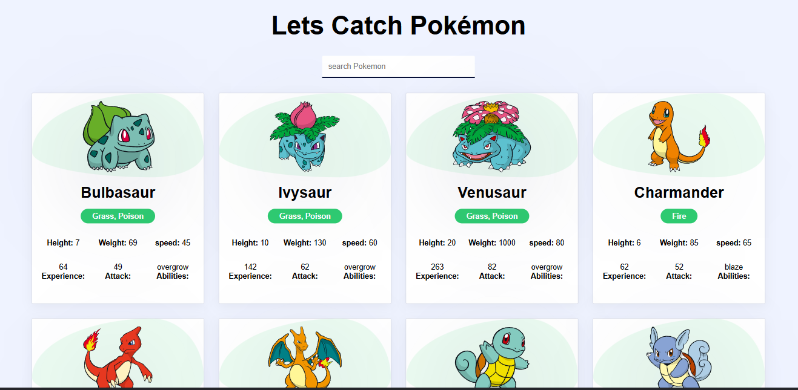

# 🧢 Pokémon Explorer App

A fun and interactive React-based web app that lets you **explore multiple Pokémon**, view their stats, abilities, types, and more. Built using the PokéAPI.


---

## 🚀 Features

- 🔍 **Search Pokémon by name**
- 📊 View detailed Pokémon data:
  - Image, Name, Type
  - Height, Weight, Speed
  - Base Experience, Attack, Abilities
- 🎨 Smooth and responsive UI with card animations
- ⚡ Fast performance with clean design

---

## 🛠️ Tech Stack

- **React** – UI Framework
- **JavaScript (ES6)** – Logic & Functionality
- **CSS** – Styling and Layout
- **PokéAPI** – Public REST API for Pokémon Data

---

## 📁 Folder Structure

```
/src
│
├── App.jsx              # Main App File
├── Pokemon.jsx          # Fetches and maps Pokémon data
├── PokemonCards.jsx     # Renders individual Pokémon Cards
├── index.css            # Styling and layout
└── main.jsx             # Entry Point
```

---

## 📦 Getting Started

### 1. Clone the Repository

```bash
git clone https://github.com/Gandham-Venkatesh/pokemon-app.git
cd pokemon-app
```

### 2. Install Dependencies

```bash
npm install
```

### 3. Run the App

```bash
npm run dev
```

Visit: `http://localhost:5173` (if using Vite)

---

## 🔌 API Used

- **PokéAPI**  
  Base URL: `https://pokeapi.co/api/v2/pokemon`  
  This app fetches **50 Pokémon** using offset and limit.

---

## 📷 Screenshot

Here's a preview of the app:

  
> 


---


## ✨ Author

Made with ❤️ by [Gandham Venkatesh](https://github.com/gandham-venkatesh)

If you like this project, give it a ⭐ and consider following me on GitHub!

